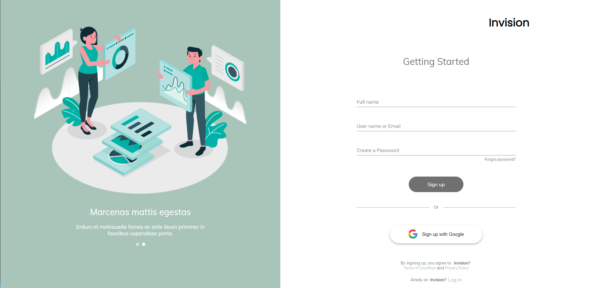

# Invision Login Page
### React JS v17.0.1

## Libs Utilizadas

Aqui estão as libs que foram utilizadas neste projeto:

* material-ui
* node-sass
* normalize.css
* react-elastic-carousel
* styled-component
* react-hook-form `<@hookform/resolvers & yup>`

## Responsavel

<table>
  <tr>
    <td align="center">
      <a href="#">
         
        
          <b>Erick Ferreira</b>
        
      </a>
    </td>
  </tr>
</table>

